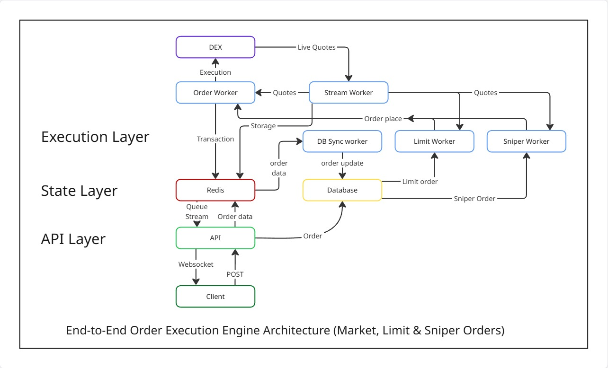
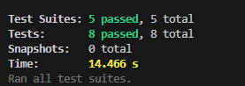
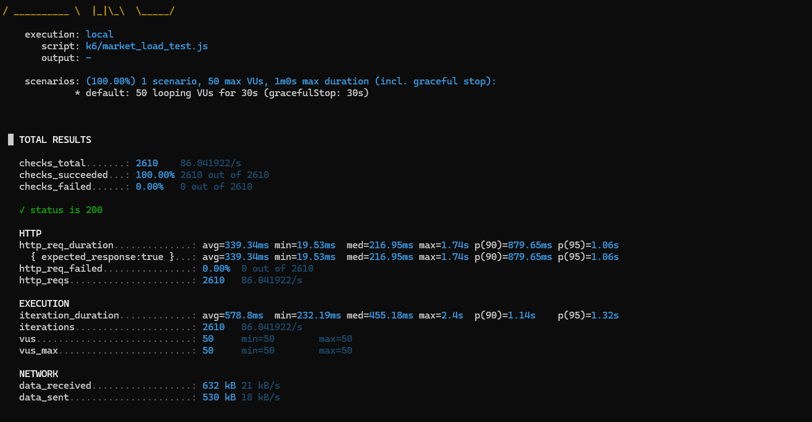
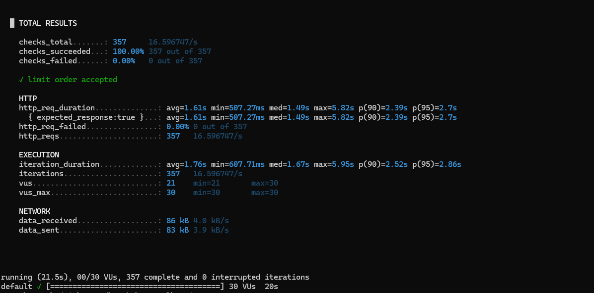
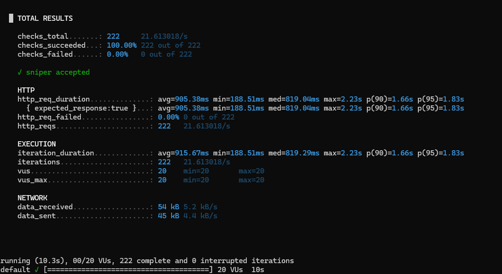
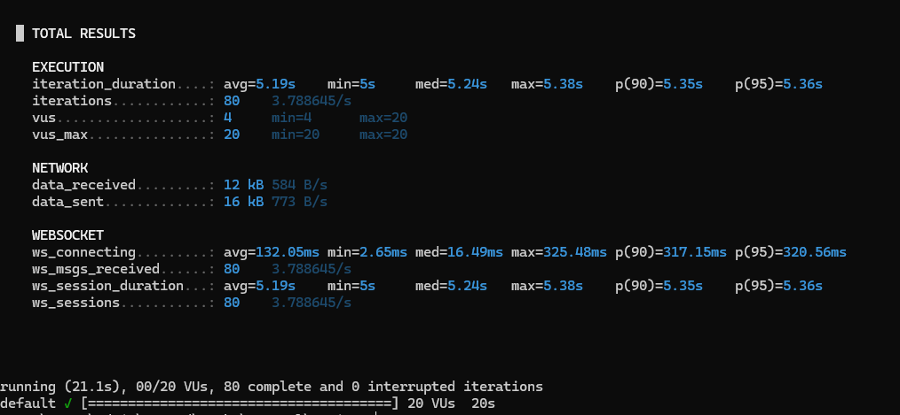

### ⚡ Order Execution Engine — Decentralized Exchange (DEX)

**Live URL:**
👉 [https://order-engine.netlify.app/](https://order-engine.netlify.app/)

### 📌 Project Overview

This project implements a **high-throughput order execution engine** tailored for the **Solana ecosystem**, focusing on:

* Intelligent decentralized exchange (DEX) routing
* Real-time order lifecycle updates via WebSockets
* Scalable & fault-tolerant processing using distributed workers

The engine emulates core components of real trading systems used in modern DEX platforms.

---

### 🎯 Problem Statement

The goal was to build a **robust, scalable, and fault-tolerant execution engine** that can:

* Process a large number of **parallel trading orders**
* **Intelligently route** each order to the best execution venue (Raydium or Meteora)
* Ensure each user receives **instant, live status updates** through a dedicated WebSocket channel
* Maintain transparent, predictable execution state across Redis, Workers, and PostgreSQL

Below is the high-level architecture used to achieve this:



---

### ✅ Order Types Supported

This engine implements **three essential trading order types**:

* **Market Orders** — Execute immediately at the best available price
* **Limit Orders** — Execute only when the target price condition is reached
* **Sniper Orders** — Execute instantly when a token becomes available or a liquidity condition is met

The system was incrementally designed:

1. **Market Orders** (base pipeline)
2. **Limit Orders** (Redis buckets + conditional triggers)
3. **Sniper Orders** (liquidity/availability triggers)

Each order type runs on its **own dedicated worker**, ensuring scalability and clean separation of concerns.

---

### 🧪 Implementation Mode — Mock Execution

To focus deeply on architecture, reliability, and real-time behavior, the engine uses a **Mock Execution Mode**:

* DEX quotes returned with **realistic delays (2–3 seconds)**
* Prices vary randomly by **2–5%**
* Execution simulates real settlement with **slippage, routing, and confirmation stages**

This allowed validating:

* Queue behavior
* Worker concurrency
* WebSocket streaming
* Redis caching
* Failover & fallback logic

without requiring on-chain execution.

---

### 🔄 Core Order Execution Flow

1. **Order Submission**
   User submits an order via:
   `POST /api/orders/execute`

2. **Validation & WebSocket Upgrade**
   API validates input → returns `orderId` → upgrades to WebSocket.

3. **DEX Routing**
   System fetches quotes from mock Raydium & Meteora → selects best venue.

4. **Execution Progress (Live Streaming)**
   User receives real-time updates such as:

   * `pending`
   * `routing`
   * `building`
   * `submitted`
   * `confirmed`
   * `failed`

5. **Settlement Simulation**
   Engine simulates the transaction, slippage, final price, and mock `txHash`.


### 🛠️ Key Technologies

| Technology               | Purpose                                                                                       |
| ------------------------ | --------------------------------------------------------------------------------------------- |
| **Node.js + TypeScript** | Strong, type-safe backend runtime ensuring reliability and maintainable code.                 |
| **Fastify**              | Ultra-fast web framework with built-in WebSocket support for real-time updates.               |
| **BullMQ + Redis**       | Distributed job queues enabling high-throughput processing, retries, DLQs, and rate-limiting. |
| **PostgreSQL + Prisma**  | Robust transactional database with type-safe ORM for persistent order storage.                |
| **Redis**                | High-speed in-memory cache for active orders, price feeds, and instant matching.              |
| **Pino**                 | Production-grade structured logging with extremely low overhead.                              |

---

### 🚀 Key Features

#### 🔹 1. Decoupled & Scalable Architecture

The engine is built using a **microservice-like worker model**, each running independently:

* API Server
* Order Execution Worker
* DBSync Worker
* Stream Worker
* Limit Worker
* Sniper Worker

This separation allows **linear scaling** by simply increasing worker replicas.

---

#### 🔹 2. Distributed Worker Model (BullMQ)

Each worker focuses on a single responsibility:

* **Order Worker** → Executes all market + triggered orders
* **Limit Worker** → Monitors price buckets & triggers executions
* **Sniper Worker** → Watches liquidity / token availability events
* **Stream Worker** → Fetches & caches Raydium/Meteora quotes
* **DBSync Worker** → Persists order results to PostgreSQL

This ensures reliability, throughput, and resilience.

---

#### 🔹 3. ⚡ High-Speed Matching with Redis Buckets (O(1) Execution)

Limit orders are stored in Redis using an **O(1) lookup model**:

```
limit_bucket:{pair}:{price} → Set(orderIds)
limit:{pair}:{orderId}      → OrderDetails
```

When the Stream Worker updates the BEST price, the Limit Worker instantly checks bucket keys and dispatches all matching orders.

This design enables **instant triggering for multiple orders at the same price**, even under heavy load.

---

#### 🔹 4. 🧠 Best Price Execution + Failover

The engine continuously compares quotes from:

* **Raydium**
* **Meteora**

It calculates `BEST = max(price - fee)` and stores it in Redis as:

```
quotes:{tokenIn}-{tokenOut}:BEST
```

If live price streaming fails, the system automatically:

➡️ Falls back to cached quotes
➡️ Or fetches fresh quotes directly from the DEX router

This ensures uninterrupted execution reliability.

---

#### 🔹 5. 🔔 Real-time Notifications via WebSockets

Each order establishes a **dedicated WebSocket channel**:

```
ws://server/ws/{orderId}
```

The user receives live updates as the order moves through:

* `pending`
* `routing`
* `building`
* `submitted`
* `confirmed`
* `failed`

Powered by BullMQ’s **QueueEvents**, ensuring immediate push updates.

---

#### 🔹 6. 💪 Fintech-Grade Reliability & Retry Logic

The system uses:

* **Exponential Backoff**
* **Jitter**
* **Auto-retries (≤3 attempts)**
* **Dead Letter Queue (DLQ)** for failed jobs
* **Stalled job recovery**
* **Job idempotency via jobId = orderId**


## 🏗️ System Architecture

The trading engine is designed using a **highly decoupled, distributed microservices-style architecture**, powered by **BullMQ** for resilient task orchestration and **Redis** for ultra-fast in-memory state management.

This architecture enables:

* High throughput
* Fault isolation
* Horizontal scalability
* Real-time feedback loops


### 🔸 Core Components Overview

* **🧑‍💻 Client**
  Initiates orders and maintains a WebSocket connection for real-time execution updates.

* **🛣️ API Server (Fastify)**
  Acts as the API gateway. Handles WebSocket upgrades, validates orders, stores early state, and dispatches jobs to workers.

* **⚙️ Workers (BullMQ)**
  Individually responsible for routing, executing, syncing, and monitoring orders.

* **🗄️ PostgreSQL**
  The source of truth for all completed, historical, or audited trades.

* **⚡ Redis**
  Powers BullMQ queues and stores active order states, cached quotes, buckets, and transient metadata.

---

## 🔍 3-Level Deep Dive into Core Components

---

## 1️⃣ API Server (Fastify)

The **Fastify server** is the primary entry point of the system.

### 🔧 Key Responsibilities

#### ✔️ Structured Logging (Pino)

Provides production-grade logs with metadata, timestamps, and worker-context — essential for debugging high-throughput systems.

#### ✔️ DB + Redis Connectivity

* Creates initial order entries in **PostgreSQL (via Prisma)**
* Stores immediate state in **Redis** for fast retrieval
* Dispatches jobs to **BullMQ queues**

#### ✔️ Order Distribution Logic

Upon receiving `/api/orders/execute`:

1. Validate input
2. Create a preliminary DB record
3. Push job → **order queue**
4. Open WebSocket channel
5. Return `orderId` instantly

#### ✔️ Real-Time WS Communication

Streams every stage update:

* `pending`
* `routing`
* `building`
* `submitted`
* `confirmed`
* `failed`

---

## 2️⃣ Order Worker (BullMQ)

The **heart of the engine** — responsible for executing all Market orders and final execution for triggered Limit/Sniper orders.

### 🧠 Core Features

#### ✔️ Job Routing

Uses **orderId as jobId** → ensures **idempotency** and prevents duplicates.

#### ✔️ Concurrency Control

Ensures only **one worker** processes a given order job at a time.

#### ✔️ High Resilience

* Retries with **Exponential Backoff + Jitter**
* Max 3 attempts
* Failed jobs → **Dead Letter Queue (DLQ)**

#### ✔️ Execution Workflow

1. Fetch BEST price
2. Build mock DEX transaction
3. Simulate slippage
4. Mark Redis state
5. Notify DBSync Worker

This worker guarantees correctness and integrity under load.

---

## 3️⃣ Stream Worker

The **data backbone** for pricing, event broadcasting, and real-time routing.

### ⚡ Responsibilities

#### ✔️ Ultra-Fast Quote Polling

Every **500ms**, fetch simulated Raydium + Meteora quotes:

* Caches them in Redis as **HASHES**
* Computes and saves `BEST` price

Redis keys include:

```
quotes:{tokenIn}-{tokenOut}:RAYDIUM
quotes:{tokenIn}-{tokenOut}:METEORA
quotes:{tokenIn}-{tokenOut}:BEST
```

#### ✔️ Fallback Logic

If API fetch fails → use last known cached quote.

#### ✔️ QueueEvents Broadcaster

Pushes live updates (from Order Worker) into the WebSocket layer.

---

## 4️⃣ DBSync Worker (BullMQ)

Ensures **database integrity** by moving finalized orders from Redis → PostgreSQL.

### 🧾 Why This Worker Exists

Decoupling DB writes prevents:

* Slow disk I/O blocking real-time execution
* Queue congestion
* Backpressure issues

### 📌 Function

* Reads finalized order state from Redis
* Constructs a complete DB object
* Inserts into PostgreSQL (Prisma)

This ensures *high throughput + strong consistency*.

---

## 5️⃣ Conditional Workers – Limit & Sniper

These workers handle logic that must run **continuously** or be **event-triggered**.

---

### 🎯 Limit Worker — O(1) Price Matching

Uses Redis buckets for instant execution:

#### Redis Structure

```
orderKey  = limit:{pair}:{orderId}
bucketKey = limit_bucket:{pair}:{targetPrice}
```

#### How It Works

* Watches BEST price
* If BEST ≥ targetPrice → move all orderIds in bucket → Order Worker queue
* Guarantees **instant trigger under load**

---

### 🎯 Sniper Worker — Event-Based Execution

Designed for:

* Token launch snipes
* Liquidity events
* Volume spikes

It triggers an order the moment required conditions are met.


## 🧪 Testing & Quality Assurance

A rigorous testing workflow was implemented to ensure the reliability, correctness, and high-performance behavior of the engine.

---

## ✅ Unit & Integration Testing

Comprehensive tests were written to validate all critical subsystems:

### 🧭 **Routing Logic**

Ensures the engine always selects the optimal DEX (Raydium/Meteora) based on quotes, liquidity, and timestamps.

### 🧱 **Queue Behavior**

Verified:

* Correct job distribution
* Concurrency safety
* Retry logic with **Exponential Backoff + Jitter**
* Automatic fallback to the **Dead Letter Queue (DLQ)** for failed jobs

### 🔄 **WebSocket Lifecycle**

Ensures every order stage (`pending → routing → building → submitted → confirmed`) is pushed to the connected client in real-time.

📌 **Unit Tests Screenshot**


---

## 🧪 Manual Testing

End-to-end scenarios for Market, Limit, and Sniper orders were validated using Postman/Insomnia.

This helped ensure:

* Input validation
* WebSocket status delivery
* Correct queue routing
* Accurate Redis + DB sync behavior

---

## 🔥 K6 Load Testing (High Throughput)

K6 tests were executed to benchmark throughput, concurrency, latency, and worker stability.

### 🎯 Load Test Target

* **100 orders/min** sustained
* **≤ 10 concurrent executions**

---

## 🚀 K6 Load Testing (High Throughput)

*Market, Limit, Sniper & WebSocket channels tested independently.*

### 📊 Summary Table

| Test Scenario               | Goal                                           |
| --------------------------- | ---------------------------------------------- |
| **Market Order Throughput** | Validate sustained market execution under load |
| **Limit Order Throughput**  | Stress-test O(1) bucket model + trigger logic  |
| **Sniper Order Throughput** | Validate instant execution when triggers fire  |
| **WebSocket Stability**     | Verify 1000+ status message broadcasts         |

---

## 📈 Market Order Load Test



---

## 📈 Limit Order Load Test



---

## ⚡ Sniper Order Load Test



---

## 🔌 WebSocket Stability Test



---


## 🚀 Deployment

The entire system is deployed using **Docker-based microservice separation**, highlighting production standards and real-world engineering practices.

---

## 🐳 Multi-Stage Docker Deployment

To ensure small and secure production images:

* **Builder stage** compiles TypeScript → optimized JS
* **Runtime stage** runs only the compiled dist (no dev dependencies)
* Images include:

  * API Server
  * Order Worker
  * Limit Worker
  * Sniper Worker
  * Stream Worker
  * DBSync Worker
  * PostgreSQL
  * Redis

This demonstrates **clean separation of concerns** similar to a distributed microservices environment.

---

## ☁️ EC2 Deployment & Monitoring

All Dockerized components were deployed to an **AWS EC2 instance** using Docker Compose.

### EC2 Setup Provided:

* Hardened environment
* Multi-container orchestration
* Network isolation between services
* External access only for API & WebSocket server
* Persistent volumes for PostgreSQL & Redis

### Ngrok HTTPS Tunnel

* Created a secure HTTPS tunnel to the EC2 backend using Ngrok.
* Exposed the EC2 HTTP server to a public HTTPS URL for easy access.


### 📜 Logging & Monitoring

Using **Pino structured logging**, enabling:

* Timestamped event tracking
* Worker-by-worker logs
* Failure analysis
* Performance debugging

---

## 🌐 Frontend Access

A minimal frontend was created to visualize real-time order updates.

**Live URL:**
👉 [https://order-engine.netlify.app/](https://order-engine.netlify.app/)

This UI demonstrates:

* WebSocket live stages
* Market/Limit/Sniper order flows
* End-to-end testing in the browser

---

## 🙏 Thank You

Thank you for reviewing the **Order Execution Engine**.
